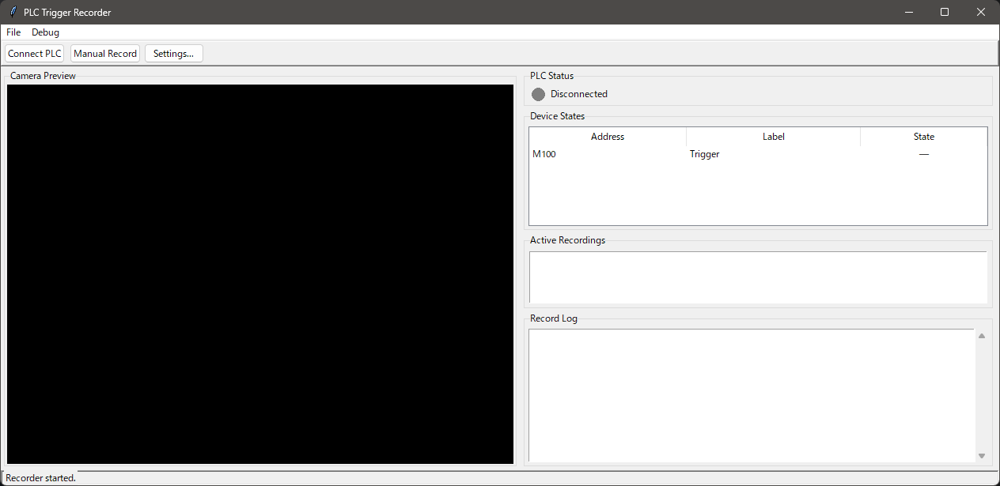

# PLC Trigger Recorder

PLCの指定ビットがON（立ち上がりエッジ）になったとき、**トリガー前後の指定秒数分の映像を動画ファイルとして保存する**ドライブレコーダー型GUIツールです。

- **対応PLC**: 三菱電機 MELSEC Q / L / QnA / iQ-L / iQ-R シリーズ（MCプロトコル 3E / 4E タイプ）
- **動作環境**: Windows 10/11、Raspberry Pi OS（64-bit）
- **Python**: 3.11 以上

---

## スクリーンショット



---

## 機能

| 機能 | 説明 |
|---|---|
| PLC ビット監視 | 複数デバイスを指定間隔でポーリング、立ち上がりエッジを検出 |
| 自動録画 | ビットON時にトリガー前後の映像を動画ファイルとして保存 |
| リングバッファ | 常時フレームをメモリに保持し、トリガー前の映像も遡って保存 |
| リアルタイムプレビュー | ~30fps でカメラ映像を表示（解像度は設定可能） |
| 手動録画 | ツールバーの「Manual Record」ボタンでいつでも録画保存 |
| 並列録画 | 複数デバイスが同時にトリガーしても、それぞれ独立して録画・保存 |
| 動画フォーマット | MP4（mp4v / avc1）・AVI（MJPG / XVID）を設定で切り替え可能 |
| 設定ダイアログ | PLC / デバイス / カメラ / 録画 / オプション の5タブ |
| 設定の永続化 | `config.json` に自動保存、次回起動時に復元 |
| シミュレーションモード | PLC未接続でも動作確認が可能（Debug メニューから有効化） |
| 日付フォルダ | 日ごとに `YYYY-MM-DD/` サブフォルダを作成（オプション） |
| デバイスサブフォルダ | デバイスラベルごとにサブフォルダを作成（オプション） |
| トリガー通知音 | トリガー発生時にビープ音を再生（beep-lite オプション） |

---

## 必要なもの

- [uv](https://docs.astral.sh/uv/) — パッケージマネージャ
- Python 3.11 以上（uv が自動でインストール）
- tkinter（Python 標準ライブラリ）
  - Windows: Python インストール時に同梱
  - Raspberry Pi OS: `sudo apt install python3-tk`
- USBカメラ

### オプション: 通知音（beep-lite）

トリガー発生時にビープ音を鳴らす場合は beep-lite をインストールします。

```powershell
# Windows（winsound を使用 — 追加依存なし）
uv sync --extra audio
```

```bash
# Linux / Raspberry Pi（simpleaudio を使用）
sudo apt-get install libasound2-dev
uv sync --extra audio
```

---

## インストールと起動

### Windows

```powershell
git clone https://github.com/Moge800/plc_trigger_recorder.git
cd plc_trigger_recorder
.\run.ps1
```

初回実行時に `uv sync` で仮想環境と依存パッケージが自動作成されます。

### Linux / Raspberry Pi

```bash
git clone https://github.com/Moge800/plc_trigger_recorder.git
cd plc_trigger_recorder
chmod +x run.sh
./run.sh
```

---

## 使い方

### 1. PLC を設定する

**File → Settings… → PLC タブ** で以下を設定します。

| 項目 | 説明 | デフォルト |
|---|---|---|
| IP Address | PLC の IP アドレス | `192.168.1.10` |
| Port | MCプロトコルのポート番号 | `1025` |
| PLC Type | Q / L / QnA / iQ-L / iQ-R | `Q` |
| Protocol | 3E / 4E | `3E` |
| Poll interval (ms) | ビット読み取り間隔 | `100` |

> PLCの事前設定（GxWorks2 / GxWorks3 でのポート開放）については  
> https://qiita.com/satosisotas/items/38f64c872d161b612071 を参照してください。

### 2. 監視デバイスを設定する

**Settings → Devices タブ** でビットデバイスを追加します。

- **Add**: デバイスアドレス（例: `M100`, `X10`）とラベルを入力
- **Toggle**: 有効 / 無効を切り替え
- **Edit / Delete**: 既存デバイスの編集・削除

### 3. カメラ・録画設定をする

| タブ | 主な設定項目 |
|---|---|
| Camera | カメラインデックス・キャプチャ解像度・プレビュー解像度・FPS |
| Record | トリガー前後の秒数・動画フォーマット・コーデック・保存先・ファイル名形式 |
| Options | 日付フォルダ（YYYY-MM-DD）・デバイスサブフォルダ・トリガー通知音 |

> **RAM使用量の目安**: 640×480・30fps・前後各10秒 ≈ 580 MB。  
> キャプチャ解像度を上げると大幅に増加します（1920×1080 では数GB規模）。

### 4. PLC に接続して監視開始

ツールバーの **「Connect PLC」** をクリックします。

接続に成功すると右ペインの状態インジケータが **緑** になり、監視が開始されます。

### 5. 自動録画

ビットが OFF → ON になると自動録画が開始されます。  
`post_trigger_sec` 秒経過後に動画ファイルが保存されます（デフォルト設定の場合）。

```
<保存先>/
└── 2026-03-30/              ← daily_folder=true の場合
    └── 20260330_153000_Trigger.mp4
```

---

## ファイル名の形式

`filename_format` には Python の `strftime` 書式 ＋ 以下のプレースホルダが使えます。

| プレースホルダ | 説明 |
|---|---|
| `%Y%m%d` | 日付（例: `20260330`） |
| `%H%M%S` | 時刻（例: `153000`） |
| `{device}` | デバイスラベル（英数字・`-_` 以外は `_` に置換） |

デフォルト: `%Y%m%d_%H%M%S_{device}` → `20260330_153000_Trigger.mp4`

---

## シミュレーションモード

PLC が手元にない場合でも動作確認ができます。

1. **Debug → Toggle Simulation Mode** でシミュレーションを有効化
2. ツールバー右端にトリガー発火コントロールが表示される
3. デバイスを選択して **「Fire!」** をクリックすると疑似トリガーが発生し録画される

---

## 開発

```powershell
# 依存パッケージのインストール（dev含む）
uv sync

# Lint チェック
uv run ruff check src/

# フォーマット
uv run ruff format src/

# 型チェック
uv run ty check src/

# 起動
uv run src/main.py
```

### ファイル構成

```
plc_trigger_recorder/
├── run.ps1               # Windows 起動スクリプト
├── run.sh                # Linux / Raspberry Pi 起動スクリプト
├── pyproject.toml        # uv / ruff / ty 設定
├── config.json           # 設定ファイル（実行時自動生成）
└── src/
    ├── main.py           # メインウィンドウ（GUI）
    ├── plc_monitor.py    # PLC監視スレッド
    ├── recorder.py       # リングバッファ録画スレッド
    ├── config.py         # 設定 dataclass + JSON 永続化
    └── settings_dialog.py # 設定ダイアログ
```

---